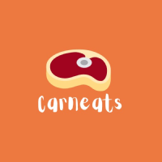

<h1 align="center">
  
</h1>

## Carneats
Aplicativo criado com o Expo que calcula seu churrasco

<p align="center">
  <a href="#-tecnologias">Tecnologias</a>&nbsp;|&nbsp;
  <a href="#-projeto">Projeto</a>&nbsp;|&nbsp;
  <a href="#-layout">Layout</a>&nbsp;|&nbsp;
</p>

## 🚀 Tecnologias

Esse projeto foi desenvolvido com as seguintes tecnologias:

- React Native
- JavaScript
- Expo


## 💻 Projeto

O Carneats calcula a quantidade de carne e bebida necessária para um churrasco a partir da quantidade de pessoas que serão convidadas pelo usuario.

## 🔖 Layout

### Tela inicial

<p align="center">
  
  
</p>


Você pode visualizar o layout do projeto através [desse link]([https://www.figma.com/file/EIKrn5JYGKPcrU7wpZckb4/Figma?node-id=0%3A1](https://www.figma.com/file/EIKrn5JYGKPcrU7wpZckb4/Figma?node-id=0%3A1)). 

## :memo: Roando a aplicação

#### Após clonar o repositório, para instalar todas as dependências, utilize o comando:

Instale as dependências com [](https://docs.npmjs.com/getting-started):

```
npm install 
--- ou ---
yarn add
```

---

Feito com ♥ by Carneats :wave:
